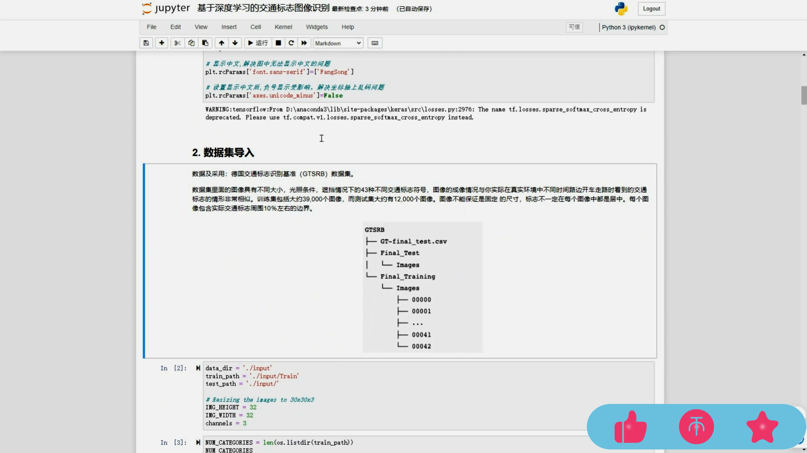
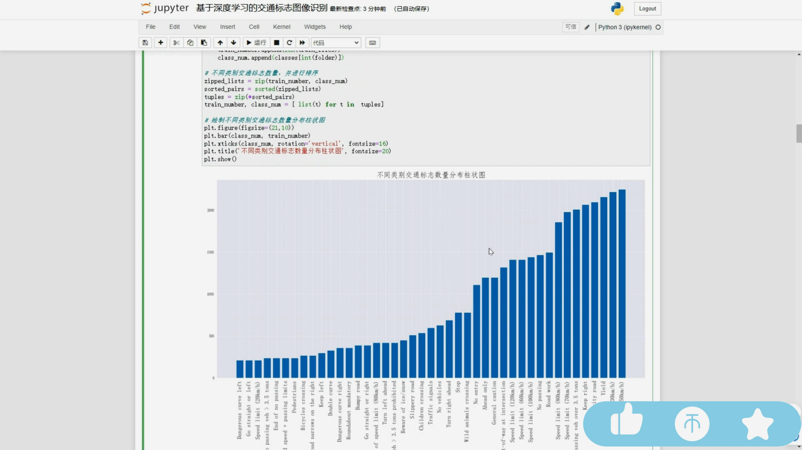
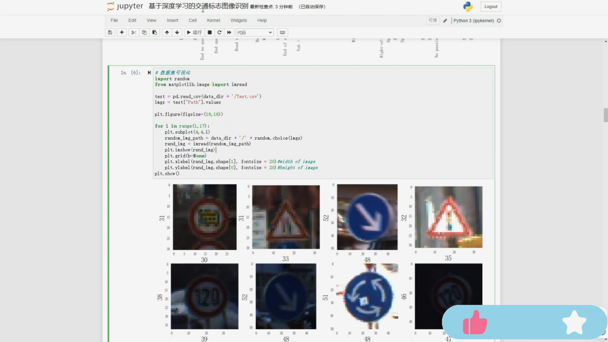
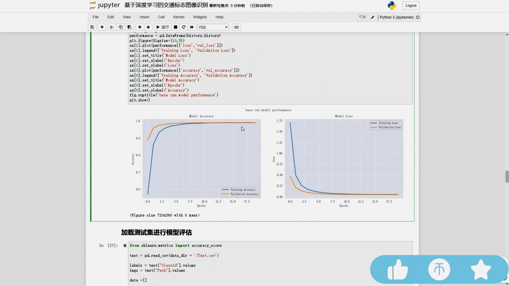
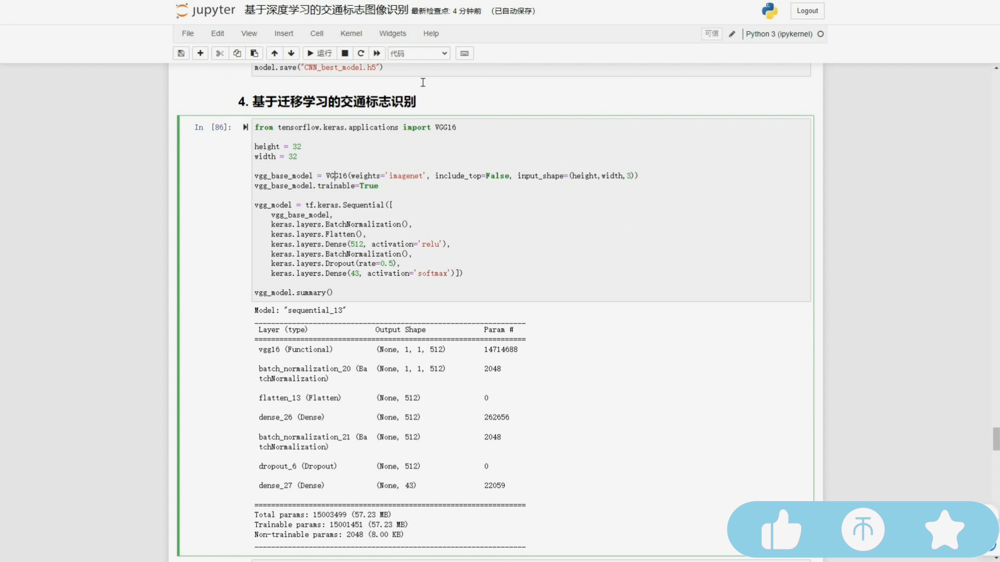
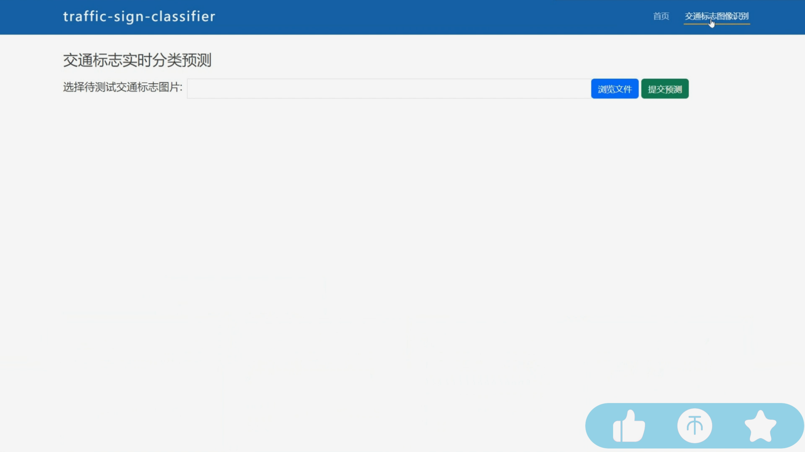
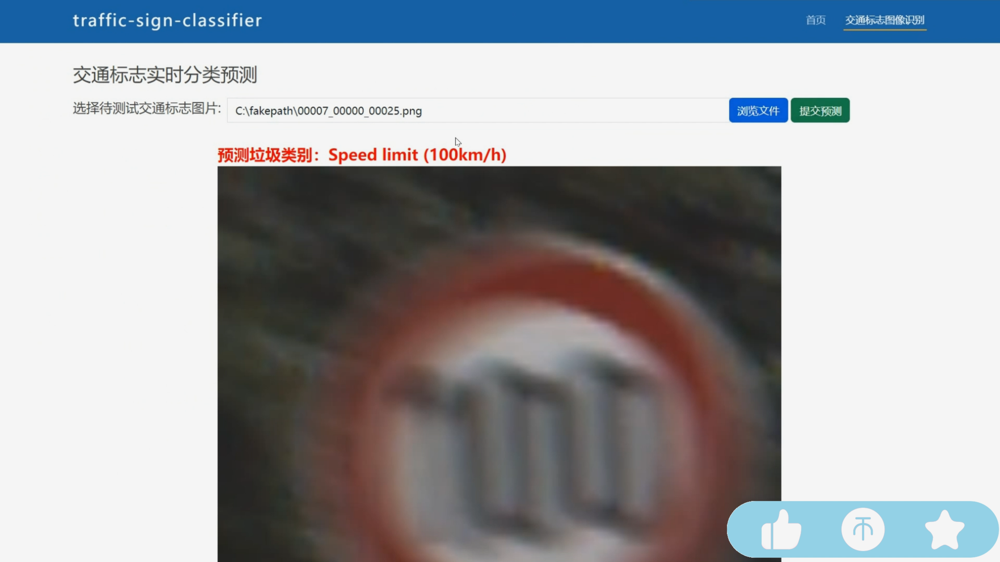
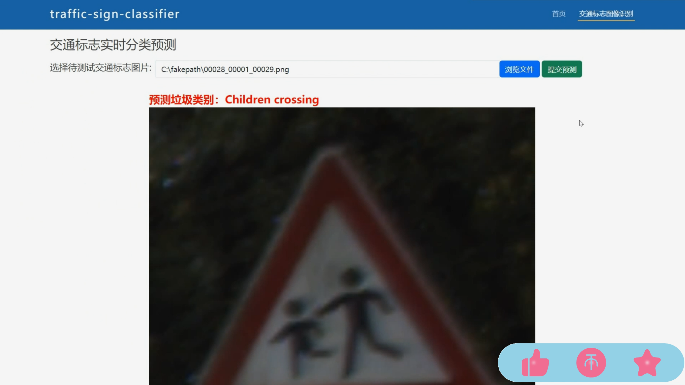

## 计算机毕业设计Python+卷积神经网络CNN交通标志识别 机器学习 深度学习 爬虫 数据可视化 人工智能 模型训练

## 要求
### 源码有偿！一套(论文 PPT 源码+sql脚本+教程)

### 
### 加好友前帮忙start一下，并备注github有偿交通标志识别
### 我的QQ号是2827724252或者798059319或者 1679232425或者微信:bysj2023nb

# 

### 加qq好友说明（被部分 网友整得心力交瘁）：
    1.加好友务必按照格式备注
    2.避免浪费各自的时间！
    3.当“客服”不容易，repo 主是体面人，不爆粗，性格好，文明人。
## 介绍
详细探讨了一基于深度学习的交通标志图像识别系统。采用TensorFlow和Keras框架，利用卷积神经网络（CNN）进行模型训练和预测，并引入VGG16迁移学习模型，取得96%的高准确率。通过搭建Web系统，用户能上传交通标志图片，系统实现了自动实时的交通标志分类识别。该系统不仅展示了深度学习在交通领域的实际应用，同时为用户提供了一种高效、准确的交通标志识别服务。

## 演示视频
https://www.bilibili.com/video/BV1gSB1YDES5/

## 运行截图

